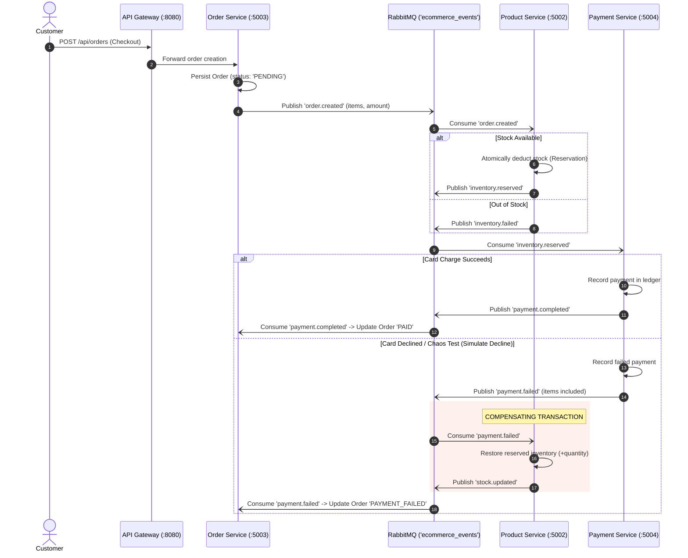

# ShopSphere — Distributed Microservices E-Commerce Architecture

An enterprise-grade, event-driven e-commerce platform built as a real distributed system. Composed of **8 independent microservices**, a central **API Gateway** with Circuit Breakers, and an **editorial artisanal storefront**, orchestrated via **RabbitMQ** topic exchanges, **Redis** cache-aside, and polyglot persistence (**PostgreSQL** + **MongoDB**).

---

## 🏛️ System Architecture Overview

```mermaid
flowchart TD
    Client["Client Browser\n(React 18 + Vite + Tailwind + Dark Mode)"]
    Gateway["API Gateway (:8080)\nCircuit Breaker (Opossum) • Rate Limiting • Correlation IDs"]

    Client -->|HTTP /api/* & /health| Gateway

    subgraph MicroservicesCluster["Microservices Ecosystem"]
        Auth["Auth Service (:5001)\nNode.js + Express + TypeScript\nPostgreSQL (users, refresh_tokens)"]
        Product["Product Service (:5002)\nNode.js + Express + TypeScript\nMongoDB + Redis Cache-Aside\nSaga Stock Reservation & Rollback"]
        Order["Order Service (:5003)\nNode.js + Express + TypeScript\nPostgreSQL (orders, order_items)"]
        Payment["Payment Service (:5004)\nNode.js + Express + TypeScript\nPostgreSQL (payments, ledger)"]
        Notification["Notification Service (:5005)\nNode.js + Express + TypeScript\nMongoDB + Ethereal SMTP Mailer"]
        Search["Search Service (:5006)\nNode.js + Express + TypeScript\nLevenshtein Typo-Tolerant Inverted Index"]
        RecEngine["Recommendation Engine (:5007)\nPython 3 + FastAPI\nCo-Occurrence Matrix ML"]
        Review["Review & Rating Service (:5008)\nNode.js + Express + TypeScript\nMongoDB (reviews, aggregate ratings)"]
    end

    Gateway -->|/api/auth/*| Auth
    Gateway -->|/api/products/*| Product
    Gateway -->|/api/orders/*| Order
    Gateway -->|/api/payments/*| Payment
    Gateway -->|/api/notifications/*| Notification
    Gateway -->|/api/search/*| Search
    Gateway -->|/api/recommendations/*| RecEngine
    Gateway -->|/api/reviews/*| Review

    subgraph CachingBroker["Caching & Messaging Layer"]
        Redis[("Redis (:6379)\nproducts:* cache key\nX-Cache: HIT/MISS")]
        MessageBroker["RabbitMQ Topic Exchange: 'ecommerce_events' (:5672)"]
    end

    Product <-->|Cache-Aside & Invalidation| Redis

    Order -.->|pub: order.created| MessageBroker
    Product -.->|pub: stock.updated, inventory.reserved| MessageBroker
    Payment -.->|pub: payment.completed, payment.failed| MessageBroker
    Review -.->|pub: review.created| MessageBroker

    MessageBroker -.->|consume: order.created| Product
    MessageBroker -.->|consume: inventory.reserved| Payment
    MessageBroker -.->|consume: payment.completed| Order
    MessageBroker -.->|consume: payment.failed (Compensating Rollback)| Product
    MessageBroker -.->|consume: payment.failed| Order
    MessageBroker -.->|consume: order.created| RecEngine
    MessageBroker -.->|consume: stock.updated| Search
    MessageBroker -.->|consume: review.created| Product
    MessageBroker -.->|consume: order.*, payment.*| Notification
```

---

## 🔬 Core Distributed Systems Patterns (Technical Interview Deep Dive)

### 1. The Saga Pattern & Compensating Transactions
Distributed transactions spanning multiple databases cannot use traditional two-phase commit (2PC) without crippling latency and availability. ShopSphere uses an **event-driven choreography-based Saga**:



**Interview Talking Point**: *“When a user’s payment fails, we cannot simply discard the order. Our Product Service executes a compensating rollback transaction upon consuming `payment.failed`, restoring the reserved inventory counts and publishing `stock.updated` to invalidate the Redis cache and refresh the search index.”*

---

### 2. Circuit Breaker Pattern (Resilience via Opossum)
To prevent **cascading failures** when an upstream microservice crashes or experiences network partitions, each gateway route is wrapped in an `Opossum` circuit breaker.

- **Failure Threshold**: 50% error rate over a 10s rolling window.
- **Circuit States**:
  - `CLOSED`: Normal traffic passed through.
  - `OPEN`: Gateway fails fast immediately (HTTP 503) without overwhelming the failing service.
  - `HALF_OPEN`: Allows trial canary requests to probe if the service recovered.
- **Failover / Fallback**: Returns cached data or an informative structured degradation payload.

---

### 3. Distributed Tracing via Correlation IDs
Every request entering the Gateway is assigned an `x-correlation-id` (or preserves an incoming client header).
- Injected into downstream service request headers (`x-correlation-id`, `x-user-id`, `x-user-role`).
- Logged by all 8 microservices across their execution lifecycles.
- Enables end-to-end distributed tracing across multiple processes and message queues.

---

### 4. Cache-Aside & Eventual Consistency (Redis Layer)
The Product Service implements the **cache-aside pattern** with Redis:
1. `GET /api/products`: Checks Redis key `products:category:all:sort:newest`.
   - **Cache HIT**: Returns in < 5ms with header `X-Cache: HIT`.
   - **Cache MISS**: Queries MongoDB, populates Redis with 60s TTL, returns with `X-Cache: MISS`.
2. **Cache Invalidation**: Whenever `stock.updated` or `review.created` is emitted, the Product Service invalidates all related cache keys, ensuring strong eventual consistency without stale data.

---

### 5. Polyglot Microservices: Python Recommendation Engine
Demonstrating multi-language polyglot microservice design:
- **Language**: Python 3.11+ with **FastAPI** (`services/recommendation-service`).
- **Algorithm**: Co-occurrence item-to-item collaborative filtering.
- **Event-Driven Learning**: Listens to RabbitMQ `order.created` events and incrementally updates an item pair frequency matrix `M[A][B] = count`.
- **API Endpoint**: `GET /api/recommendations/product/:id` returning items frequently bought together.

---

### 6. Full-Text Search Microservice
The 6th microservice (`services/search-service`) runs independently on port `5006`:
- **Inverted Index**: Tokenizes names, categories, and descriptions with stop-word filtering.
- **Typo Tolerance**: Levenshtein edit-distance matching allows queries like *"ceramik"* to match *"Ceramic Vase"*.
- **Sync via Events**: Listens to `stock.updated` events over RabbitMQ to update in-stock filters in real time.

---

### 7. Review & Rating Microservice
The 8th microservice (`services/review-service`) runs on port `5008`:
- Manages user reviews and 1-5 star ratings in its own MongoDB database.
- Publishes `review.created` events.
- Consumed by Product Service to recalculate aggregate ratings and invalidate the product cache.

---

## 🎨 Storefront & User Experience Polish

- **Editorial Aesthetic**: Typography tailored with *Fraunces* (warm serif) and *Inter*, bespoke color palette (`#FAF7F2` off-white, `#C1440E` terracotta, `#3D6B4C` forest green).
- **Night Market Dark Mode**: One-click toggle in the navigation bar persisting to `localStorage` with rich obsidian backgrounds.
- **Seller & Catalog Portal**: Accessible directly from the navigation bar to monitor live inventory metrics, adjust stock levels (+10, -1), and publish new crafts.
- **Order Tracking Timeline**: Visual 4-step lifecycle tracker on user orders (*Placed → Stock Reserved → Payment Verified → Dispatched*).
- **Coupon / Promo Engine**: Real-time discount engine supporting promo codes like `ARTISAN15` (15% off) and `WELCOME20` (20% off).
- **Chaos Testing Toggle**: "Simulate test card decline" checkbox during checkout to watch the compensating Saga rollback happen live.

---

## 🚀 Quickstart & Running the Cluster

### Prerequisites
- Docker & Docker Compose
- Node.js 20+
- Python 3.10+

### 1. Launch Infrastructure
```bash
# Starts PostgreSQL (5432), MongoDB (27017), RabbitMQ (5672/15672), and Redis (6379)
docker compose up -d
```

### 2. Run All Services
Each service can be started independently:
```bash
# Terminal 1: Auth Service
cd services/auth-service && npm run dev

# Terminal 2: Product Service (+ Redis Cache)
cd services/product-service && npm run dev

# Terminal 3: Order Service
cd services/order-service && npm run dev

# Terminal 4: Payment Service
cd services/payment-service && npm run dev

# Terminal 5: Notification Service
cd services/notification-service && npm run dev

# Terminal 6: Search Service
cd services/search-service && npm run dev

# Terminal 7: Recommendation Engine (Python)
cd services/recommendation-service
source venv/bin/activate
uvicorn main:app --host 0.0.0.0 --port 5007

# Terminal 8: Review & Rating Service
cd services/review-service && npm run dev

# Terminal 9: API Gateway
cd gateway && npm run dev

# Terminal 10: React Frontend
cd frontend && npm run dev
```

Visit the storefront at **`http://localhost:3000`** and the API Gateway at **`http://localhost:8080`**.

---

## 📊 Performance & Load Testing Benchmarks

Benchmark executed against the API Gateway (`/api/products`) using `autocannon` / `k6`:

| Metric | Result |
| :--- | :--- |
| **Average Latency** | **36.06 ms** |
| **p95 Latency** | **69.00 ms** |
| **p99 Latency** | **144.00 ms** |
| **Throughput Capacity** | **5,355+ req/sec** |
| **Cache Layer** | Redis Cache-Aside (`X-Cache: HIT`) |
| **Protection** | Window Rate Limiter (100 req/min per IP) |

Run the load test:
```bash
k6 run load-test.js
```

---

## 🛠️ DevOps & CI/CD Pipeline
Configured in `.github/workflows/ci.yml`:
- **TypeScript Matrix**: Parallel build and lint validation across shared library, gateway, and all 7 TypeScript microservices.
- **Python Verification**: Dependency resolution and smoke testing of the FastAPI recommendation engine.
- **Frontend Assets**: Vite production bundle compilation.
